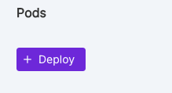
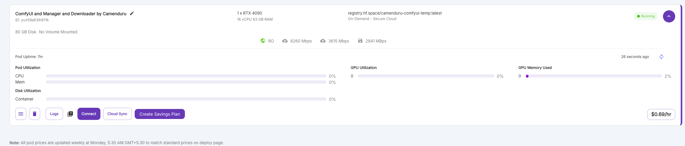
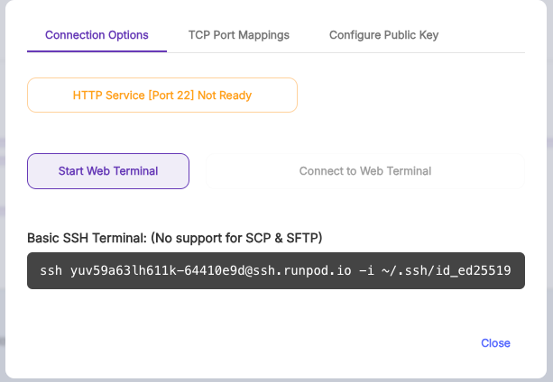
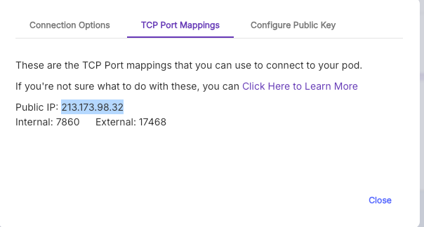
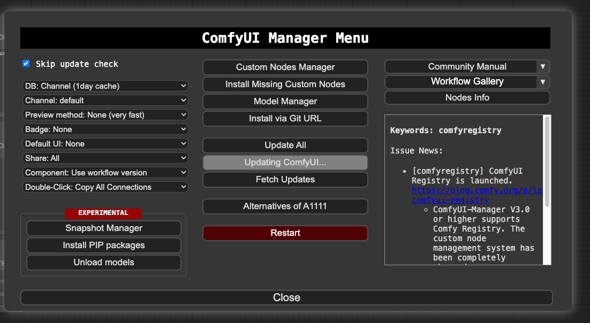

## Steps to RUN AI video booth Application

### TECH Involved
* Frontend - React | JavaScript
* Backend - Python | Flask API
* RunPod - GPU for AI Video Generation and running ComfyUI tool


### STEPS for running RUNPOD and Enabling it for API access

#### Before we start we can divide installation into 2 categories

* RunPod Configuration
* Comfyui Update, Models and Custom Nodes Installation

#### Runpod Configuration

* Login to https://www.runpod.io/console 
* Create one POD by clicking on Deploy Button



* Choose the following configuration (machine selection may vary based on requirement)
    > Machine Name : RTX4090 - GPU Count 1

    > Image Name : ComfyUI and Manager and Downloader by Camenduru (registry.hf.space/camenduru-comfyui-temp:latest)

* Once deployed we will be able to see this



* Click on edit pod and interchange the Expose HTTP and TCP ports (default it is 7860 and 22), once done Container will re-initiate again

* Click on Connect Button, Connect window will open as shown in below



* Click on Start Web terminal and open terminal in One tab 

* Go to TCP Port Mappings in Connect window, You will be able to see the public IP and External port combine both of them open that for example in the following image the link is http://213.173.98.32:17468 which will redirect you to COMFYUI



* Once this is done COMFY UI will be up and running

#### Comfyui Update, Models and Custom Nodes Installation

* Once ComfyUI is ready, Click on Manager - Click on Update Comfy UI



* Parallely go to web terminal you will be in Comfyui path you need to install models and custom nodes to their respective folders

* clone our git repo here COMfyUI path , If its first time it may ask for access Please give the access by creating personal access tokens for Organization repository

    ```
    git clone https://github.com/Craftech360-projects/ai-videobooth-backend.git
    ```

* Run the start.sh file to download all the custom nodes and models into Comfy ui folder respectively


